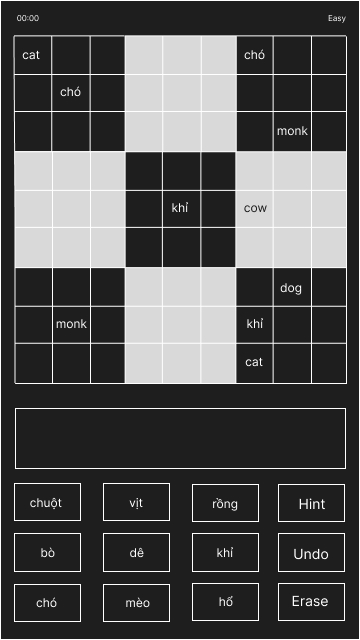
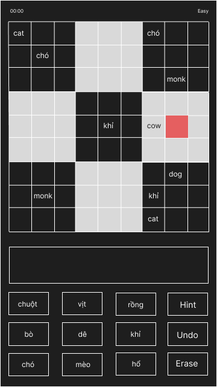
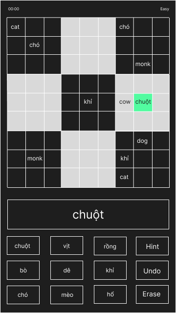
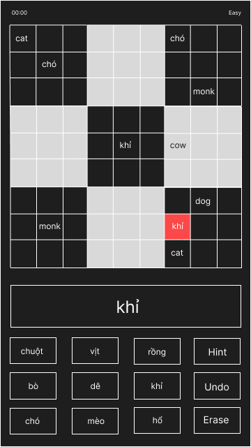
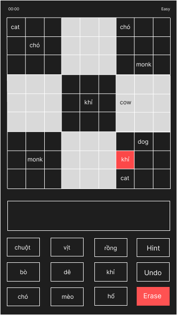
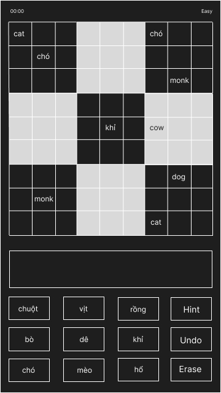
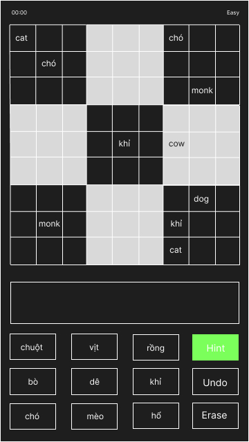
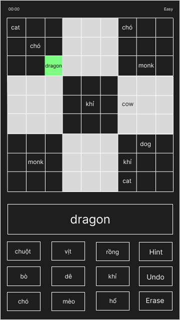

## Iteration 1

1. **User story**: As a novice user, I want an easy-to-use user interface, so that I don't get frustrated while playing.
    
    **TDD Examples**:
    1. When an user plays the game, pressing on the grid will highlight it, and tapping on the word will place that word into the grid.

    
    
    
    
    2. When an user plays the game, pressing on the grid will highlight it, and then pressing the delete button will remove the word from that grid.

    
    
    

2. **User story**: As a novice user, I want hints for words that I don't know, so that I can still progress through the game.

    **TDD Example**: When an user gets stuck, tapping on hint button will randomly fill in a grid with the correct answer.

    
    
